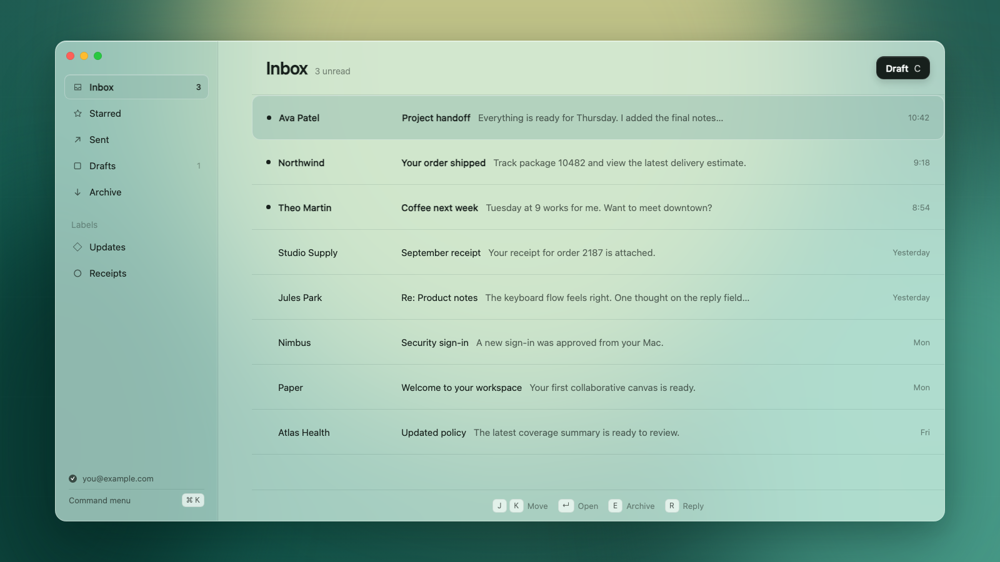

# Mail

[](https://github.com/bradymoore1010/mail/actions/workflows/ci.yml)
[](LICENSE)



A native, minimalist Gmail client for macOS. Mail keeps the inbox fast, the interface quiet, and the full workflow within reach of the keyboard.

[Download the latest release](https://github.com/bradymoore1010/mail/releases/latest) · [Watch the 19-second launch film](docs/assets/mail-launch.mp4) · [Connect Gmail](GMAIL_SETUP.md)

## What makes Mail different

- **Native from the window down.** SwiftUI, AppKit editing, WebKit message rendering, Keychain credentials, and a local SQLite/FTS5 cache. No Electron shell and no hosted backend.
- **Keyboard-first by default.** Navigate, search, archive, star, compose, reply, format, attach, and send without reaching for the mouse.
- **Correspondence-aware threads.** A first-contact message opens as a reader and waits for `R` or the Reply button. A conversation you have already joined opens on the latest incoming message with the reply composer ready.
- **Your whole Gmail address book.** Recipient autocomplete is built in the background from addresses across Sent mail, including From, To, Cc, Bcc, and Reply-To headers.
- **Local-first speed.** The cached inbox renders before OAuth refresh or network work. Gmail synchronization, MIME parsing, indexing, and attachment work stay off the main actor.
- **A restrained frosted-glass interface.** One compact sidebar, one focused inbox, and one conversation surface rather than a dashboard of secondary tools.

## Install

Mail requires macOS 14 or later.

### Download

Download the `Mail-macOS-vX.Y.Z.zip` build from the [latest GitHub release](https://github.com/bradymoore1010/mail/releases/latest), unzip it, and move `Mail.app` to Applications.

The public build is ad-hoc signed because this personal project does not currently use an Apple Developer ID or notarization. If macOS blocks that download, build from source below. The source build is the cleanest installation path until notarized releases are available.

### Build from source

Install Apple's command-line developer tools, then run:

```bash
git clone https://github.com/bradymoore1010/mail.git
cd mail
./scripts/build-app.sh
open "Mail.app"
```

Mail opens with a fictional sample inbox. Follow [GMAIL_SETUP.md](GMAIL_SETUP.md) when you are ready to connect your own Gmail account.

## Keyboard controls

| Keys | Action |
| --- | --- |
| `⌘K` | Search all mail or run a command |
| `/` or `⌘F` | Search the current mailbox |
| `J` / `K` | Move to the next or previous conversation |
| `Return` | Open the selected conversation |
| `E` | Archive and advance |
| `R` | Open or focus reply |
| `S` | Toggle star |
| `U` | Toggle read state |
| `C` | Compose |
| `G`, then `I/S/T/D/A` | Jump to Inbox, Starred, Sent, Drafts, or Archive |
| `⌘Return` | Send |
| `⌘Z` or `Ctrl-Z` | Undo the latest archive or send within five seconds |
| `Esc` | Close the current layer |

Formatting, list, indentation, and attachment shortcuts are documented in [docs/KEYBOARD_SHORTCUTS.md](docs/KEYBOARD_SHORTCUTS.md).

## Search

Search is case-, width-, and diacritic-insensitive. Every free-text term must match, and sender or subject hits rank above preview and body hits.

```text
from:ava
subject:"project handoff"
label:receipts
is:unread
is:starred
has:attachment
```

Command-K uses the same engine across every mailbox and mixes matching actions with mail results. Local FTS results appear while typing; Gmail search is a fallback for older messages outside the recent cache.

## Gmail and privacy

Mail talks directly to Google's Gmail API. OAuth uses Authorization Code with PKCE and a temporary loopback callback. Refresh tokens stay in macOS Keychain; normalized mail and search data stay in a local SQLite database.

Each user supplies a Google Desktop OAuth client JSON. Credentials, tokens, databases, real mail, and private QA captures are explicitly excluded from this repository. See [GMAIL_SETUP.md](GMAIL_SETUP.md), [docs/PRIVACY.md](docs/PRIVACY.md), and [SECURITY.md](SECURITY.md).

## Performance

The release harness exercises 10,000 threads and 29,352 messages, including long conversations, HTML, inline images, attachments, labels, and mixed read states.

- All 19 established interaction metrics stayed within the strict `+5%` regression gate after Gmail directory and correspondence-aware thread behavior were added.
- The frosted-glass production comparison measured a `422.672 ms` p95 warm first useful frame.
- Accepted sustained-use runs recorded `9.94 ms` worst action-latency p95, zero main-thread tasks over 50 ms, and no resident-memory growth.
- The deterministic behavior suite contains 57 passing tests.

The methodology, raw metric definitions, rejected-run policy, and limitations are in [docs/PERFORMANCE_REPORT.md](docs/PERFORMANCE_REPORT.md). The performance contract is in [PERFORMANCE.md](PERFORMANCE.md).

## Development

Run the deterministic test suite and build the release app:

```bash
./scripts/test.sh
./scripts/build-app.sh
```

Run focused performance checks:

```bash
./scripts/benchmark.sh release-check 3
./scripts/benchmark-launch.sh release-launch-check 5
./scripts/soak-test.sh 900 release-soak-check
```

The launch film and repository artwork are reproducible Remotion compositions:

```bash
cd launch-video
npm install
npm run lint
npm run render
```

Generated mail fixtures, app bundles, test data, performance results, and video renders are ignored. Only the reviewed public assets under `docs/assets/` are committed.

## Architecture

```text
SwiftUI and AppKit views
          ↓
      MailStore
       ↙     ↘
SQLite/FTS5   GmailIntegration
 local cache       ↓
               Gmail API
```

`MailStore` owns user-visible state on the main actor. Actor-isolated Gmail and SQLite components perform network and persistence work. Cached summaries render first, full conversations hydrate on demand, and optimistic actions reconcile with Gmail in the background. See [docs/ARCHITECTURE.md](docs/ARCHITECTURE.md) for the full map.

## Project status

Version 1.0 is a production-ready personal release for macOS with Gmail as its only live provider. It is intentionally narrow: no calendar, tasks, hosted service, multi-provider abstraction, or mobile client. Google OAuth setup is still user-owned, and the downloadable app is not yet notarized.

## About the maker

Mail is designed and built by [Brady Moore](https://github.com/bradymoore1010) as an opinionated daily-use experiment in native, keyboard-first software. The source, performance harness, interactive prototype, launch-film project, and public design assets are all included here.

## Contributing

Issues and focused pull requests are welcome. Read [CONTRIBUTING.md](CONTRIBUTING.md) before changing behavior, and never include credentials, real mail, local databases, or private screenshots in an issue or commit.

## License

Mail is available under the [MIT License](LICENSE). It is an independent personal project and is not affiliated with, endorsed by, or sponsored by Google or Apple. Gmail is a trademark of Google LLC; macOS is a trademark of Apple Inc.
