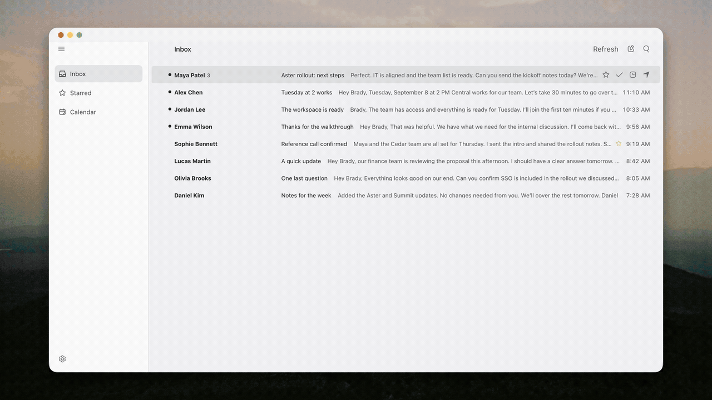

# superlocal-brady

Using superlocal (Superhuman open source cloan) and customizing it around how I use email.

Less stuff in the sidebar. Easier to read replies. One inbox with hot keys.

### What I changed

- Simplified the sidebar to Inbox, Starred, and Calendar, with Settings at the bottom and the other folders in a drawer.
- Gave it a white theme and cleaned up some of the UI, including the menus and calendar editor.
- Changed the app icon and added star icons in the inbox and reader.
- Put recognized Gmail quoted replies into separate cards, oldest first. Long conversations open at the newest message, with the original email view still available.
- Added calendar dragging to select a time range. It opens a draft so you can check it before saving.
- Updated the Mac wrapper so web links open in Chrome and the inbox stays where it is. Also made the titlebar use the light appearance.
