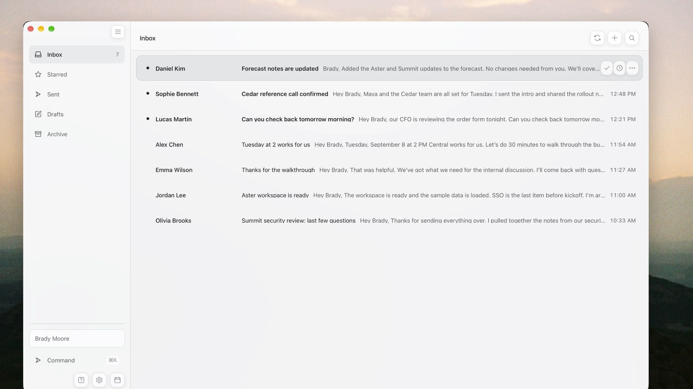

# swaggerhuman

[](https://github.com/bradymoore1010/swaggerhuman/actions/workflows/ci.yml)
[](LICENSE)

[](https://github.com/bradymoore1010/swaggerhuman/raw/refs/heads/main/docs/assets/swaggerhuman-demo.mp4)

swaggerhuman is a mail app for macOS. Fast inbox, keyboard controls, and a little frosted glass. Open it, handle your email, get back to what you were doing.

[Download the 50-second demo](https://github.com/bradymoore1010/swaggerhuman/raw/refs/heads/main/docs/assets/swaggerhuman-demo.mp4) · [Download the original Swift release](https://github.com/bradymoore1010/swaggerhuman/releases/latest) · [Connect Gmail](GMAIL_SETUP.md)

The demo shows the current swaggerhuman build. The app source and release download here are the original Swift Mail build.

## What it does

- **The whole email workflow from the keyboard.** Navigate, search, archive, star, write, reply, format, attach, and send.
- **Replies are ready when they should be.** A first-contact email opens for reading. Hit `R` when you want to reply. If you've already joined the conversation, it opens on the latest incoming message with the reply box ready.
- **Autocomplete from your Gmail history.** Mail builds a recipient directory in the background from From, To, Cc, Bcc, and Reply-To addresses across Sent mail.
- **Your inbox opens from the local cache.** It doesn't wait for OAuth or the network. Gmail sync, MIME parsing, indexing, and attachment work run off the main actor.
- **A small native app.** SwiftUI, AppKit editing, WebKit email rendering, Keychain credentials, and SQLite/FTS5 storage. One compact sidebar, one inbox, one conversation. No Electron or hosted backend.

## Install

You'll need macOS 14 or later.

### Download

Grab `Mail-macOS-vX.Y.Z.zip` from the [latest release](https://github.com/bradymoore1010/swaggerhuman/releases/latest), unzip it, and move `Mail.app` to Applications.

The download is ad-hoc signed. This is a personal project, and I haven't added Apple Developer ID signing or notarization yet. If macOS blocks it, build from source below. That's the cleanest install for now.

### Build from source

Install Apple's command-line developer tools, then:

```bash
git clone https://github.com/bradymoore1010/swaggerhuman.git
cd swaggerhuman
./scripts/build-app.sh
open "Mail.app"
```

It opens with a fictional inbox so you can try it first. Follow [the Gmail setup guide](GMAIL_SETUP.md) to connect your account.

## Keyboard controls

| Keys | Action |
| --- | --- |
| `⌘K` | Search all mail or run a command |
| `/` or `⌘F` | Search the current mailbox |
| `J` / `K` | Move to the next or previous conversation |
| `Return` | Open the selected conversation |
| `E` | Archive and advance |
| `R` | Open or focus reply |
| `S` | Toggle star |
| `U` | Toggle read state |
| `C` | Compose |
| `G`, then `I/S/T/D/A` | Jump to Inbox, Starred, Sent, Drafts, or Archive |
| `⌘Return` | Send |
| `⌘Z` or `Ctrl-Z` | Undo the latest archive or send within five seconds |
| `Esc` | Close the current layer |

The [full shortcut list](docs/KEYBOARD_SHORTCUTS.md) covers formatting, lists, indentation, and attachments too.

## Search

Search ignores differences in case, character width, and accents. Every free-text term has to match. Sender and subject matches come before matches in the preview or body.

```text
from:ava
subject:"project handoff"
label:receipts
is:unread
is:starred
has:attachment
```

`⌘K` searches every mailbox and shows matching commands alongside mail. Local FTS results appear as you type. For older messages outside the recent cache, it falls back to Gmail search.

## Gmail and privacy

Mail talks directly to Google's Gmail API. Refresh tokens live in macOS Keychain. Mail and search data live in a local SQLite database. OAuth uses Authorization Code with PKCE and a temporary loopback callback.

You'll need your own Google Desktop OAuth client JSON. Credentials, tokens, databases, real email, and private QA captures stay out of this repo. The details are in [Gmail setup](GMAIL_SETUP.md), [privacy](docs/PRIVACY.md), and [security](SECURITY.md).

## Performance

The release checks use 10,000 threads and 29,352 messages, with long conversations, HTML, inline images, attachments, labels, and a mix of read and unread mail. The recorded results:

- All 19 interaction metrics stayed within the `+5%` regression limit after adding the Gmail directory and conversation-aware reply behavior.
- The frosted-glass production comparison reached its first useful frame in `422.672 ms` at p95 on a warm launch.
- Accepted sustained-use runs had a worst action-latency p95 of `9.94 ms`, zero main-thread tasks over 50 ms, and no resident-memory growth.
- The deterministic behavior suite passed all 57 tests.

The [performance report](docs/PERFORMANCE_REPORT.md) explains how these were measured, what the metrics mean, which runs were rejected, and where the results have limits. [PERFORMANCE.md](PERFORMANCE.md) has the performance contract.

## Development

Run the tests and build the app:

```bash
./scripts/test.sh
./scripts/build-app.sh
```

For performance checks:

```bash
./scripts/benchmark.sh release-check 3
./scripts/benchmark-launch.sh release-launch-check 5
./scripts/soak-test.sh 900 release-soak-check
```

The launch film and repo artwork are built with Remotion. You can render them yourself:

```bash
cd launch-video
npm install
npm run lint
npm run render
```

Generated mail fixtures, app bundles, test data, performance results, and video renders are gitignored. Only reviewed public assets in `docs/assets/` are committed.

## Architecture

```text
SwiftUI and AppKit views
          ↓
      MailStore
       ↙     ↘
SQLite/FTS5   GmailIntegration
 local cache       ↓
               Gmail API
```

`MailStore` owns what you see on the main actor. The Gmail and SQLite components handle network and storage work in their own actors. Cached summaries show up first, full conversations load when you open them, and actions update the UI immediately while Gmail catches up in the background. The [architecture doc](docs/ARCHITECTURE.md) has the full map.

## Project status

Version 1.0 is a personal release for macOS. Gmail is the only live provider. The scope is small: no calendar, tasks, hosted service, multi-provider layer, or mobile app. You'll still need to set up Google OAuth yourself, and the download isn't notarized yet.

## Who built it

I'm [Brady Moore](https://github.com/bradymoore1010). I designed and built Mail as an opinionated daily-use experiment in native software you can run from the keyboard. The source, performance checks, interactive prototype, launch film project, and public design assets are all here.

## Contributing

Found a bug or have a focused change in mind? Open an issue or PR. Read [CONTRIBUTING.md](CONTRIBUTING.md) before changing behavior. Keep credentials, real email, local databases, and private screenshots out of issues and commits.

## License

Mail uses the [MIT License](LICENSE). It's an independent personal project, with no affiliation, endorsement, or sponsorship from Google or Apple. Gmail is a trademark of Google LLC; macOS is a trademark of Apple Inc.
